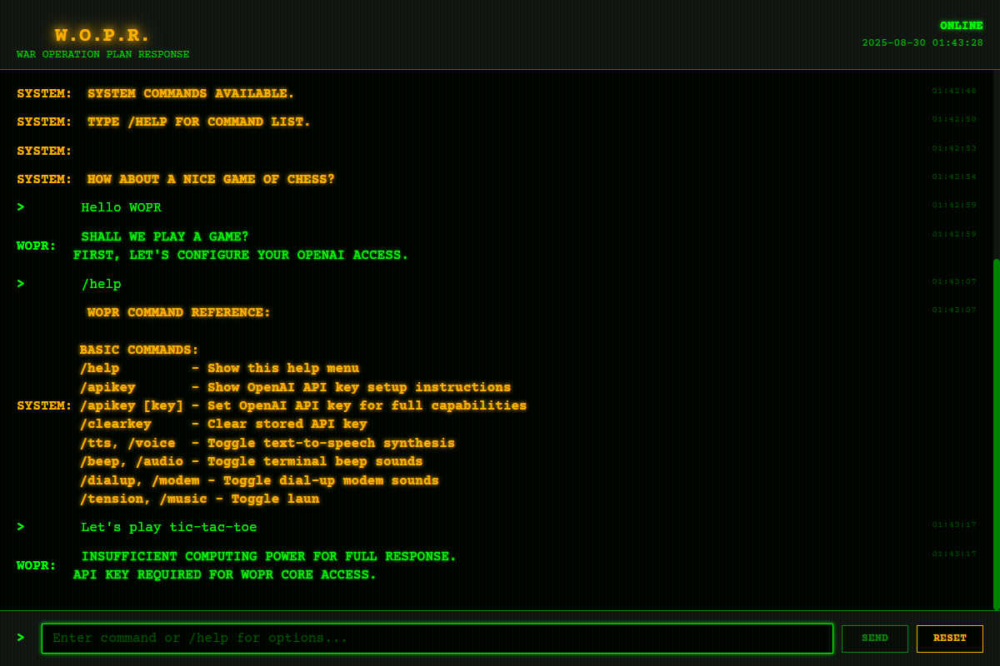

# WOPR AI Chatbot - War Games 1983 Emulation

> **🤖 AI-Generated Project**: This entire codebase, including comprehensive frontend application, OpenAI integration, test suites, documentation, and deployment configurations, was designed and implemented by **Claude 3.5 Sonnet** (Anthropic's AI assistant). The project demonstrates advanced AI-driven software development capabilities, including frontend-only architecture with direct OpenAI integration, testing automation, CI/CD pipeline setup, and technical documentation creation. Every line of code, from the direct OpenAI Chat API integration to the Angular frontend with authentic CRT styling and Playwright end-to-end tests, represents AI-generated software engineering.
> **🧪 AI-Driven Testing Excellence**: The project features a comprehensive Playwright test suite with 16 passing tests across multiple browsers, complete audio mocking for Web Speech API and Audio constructor handling, sophisticated element state management, and OpenAI integration testing. The tests validate slash command functionality (`/help`, `/tts`, `/beep`, `/dialup`, `/tension`, `/reset`, `/apikey`) after removing UI toggle buttons in favor of terminal-style commands, ensuring authentic 1983 computer experience. All test scenarios, mocking strategies, and assertion patterns were designed and implemented by AI.

A complete Visual Studio Code workspace featuring a WOPR (War Operation Plan Response) computer emulation from the 1983 movie "WarGames". This project uses a **frontend-only architecture** with direct OpenAI API integration, featuring an Angular application with authentic CRT terminal styling, text-to-speech, user-provided API key management, and comprehensive fallback systems.


## 🌐 Live Demo

**🎮 [Try WOPR Online](https://vincemic.github.io/wopr-ai-chatbot/)**

Experience the authentic 1983 War Games WOPR computer interface directly in your browser! The live demo includes all features: connection prompt, dial-up modem sounds, text-to-speech, and the complete WOPR personality.

### Screenshots

**Initial Connection Prompt**


**Dial-Up Connection Sequence**


**Chat Interface with WOPR**


**Matrix Theme with Falling Symbols**


> **Note**: For full OpenAI integration, follow the local setup instructions below to configure your API key.

## Recent Enhancements

### Local Storage Settings System

- **Persistent Configuration**: Complete settings management with localStorage persistence across browser sessions
- **Visual Settings Panel**: Modern interface with organized categories for audio, display, and AI preferences
- **Real-Time Updates**: Instant application of setting changes with reactive programming patterns
- **Import/Export Functionality**: JSON-based settings backup and restore capabilities
- **Settings Commands**: New slash commands `/config`, `/export-settings`, `/reset-settings` for terminal-style configuration
- **Theme Support**: Multiple visual themes (Classic Green, Amber, Blue, Matrix) with CSS custom properties
- **Mobile Responsive**: Touch-friendly settings interface optimized for all device sizes
- **Accessibility Compliant**: ARIA labels, screen reader support, and keyboard navigation

### Slash Command Interface

- **Terminal-Style Commands**: Replaced UI toggle buttons with `/help`, `/tts`, `/beep`, `/dialup`, `/tension`, `/status`, `/reset`, `/apikey` commands
- **Authentic Terminal Experience**: Command-driven interface matching 1983 computer systems
- **Comprehensive Help System**: `/help` command provides complete usage instructions
- **Audio Control Commands**: `/tension` and `/music` commands control launch code computer beeps
- **Command Validation**: Smart error handling for unknown or malformed commands

### Mobile Touch Support

- **Connection Prompt Enhancement**: Mobile devices can now interact with the "Connect yes or no?" prompt using touch gestures
- **Haptic Feedback**: Provides tactile feedback on supported mobile devices
- **Responsive Design**: Optimized touch targets and mobile-friendly interface
- **Cross-Platform Compatibility**: Works seamlessly on desktop (mouse/keyboard) and mobile (touch)

### OpenAI Integration

- **Direct Browser-to-OpenAI Communication**: No backend required, uses browser fetch API
- **User-Provided API Keys**: Secure localStorage-based API key management
- **Cost-Effective Model**: Uses gpt-4o-mini for optimal performance and cost balance
- **WOPR Personality System**: Complete War Games character implementation with authentic responses

### CI/CD Improvements

- **GitHub Pages Deployment**: Automatic deployment with frontend-only architecture
- **Comprehensive Testing**: Playwright test suite with 16 test scenarios
- **Cross-Browser Support**: Validated on Chromium, WebKit, and mobile browsers
- **Continuous Integration**: Automated testing and deployment pipelines

## Project Structure

This workspace contains a **frontend-only Angular application** with direct OpenAI integration delivering an authentic WOPR experience:

1. **Frontend-Only Architecture**: Angular 18+ application with direct OpenAI Chat API integration
2. **User-Provided API Keys**: Secure local storage of OpenAI API credentials  
3. **No Backend Required**: Complete WOPR experience runs entirely in the browser

## 🏗️ Architecture

```text
ai-wopr/
├── frontend/wopr-frontend/    # Angular Application
│   ├── src/app/
│   │   ├── wopr-chat/        # Main WOPR interface component
│   │   ├── models/           # TypeScript models
│   │   └── assets/           # Audio files and styling
│   └── tests/                # Playwright tests
└── README.md                 # This file
```

## 🚀 Features

### Frontend (Angular 18+ with Direct OpenAI Integration)

- **Direct OpenAI Chat API Integration** with gpt-4o-mini model and full WOPR personality
- **User-Provided API Key Management** with secure browser storage and setup instructions
- **Persistent Settings System** with localStorage, visual settings panel, and import/export functionality
- **Comprehensive Slash Command System** (`/help`, `/apikey`, `/status`, `/tts`, `/beep`, `/dialup`, `/tension`, `/reset`, `/config`)
- **Multiple Visual Themes** including Classic Green, Amber, Blue, and Matrix with real-time switching
- **Authentic CRT terminal styling** with phosphor glow, scan lines, and dot-matrix effects
- **Real-time chat interface** with WOPR computer personality and character-by-character typing
- **Text-to-Speech** functionality with robotic voice configuration and voice selection
- **Terminal beeping sounds** using Web Audio API (800Hz square wave)
- **Launch Code Computer Beeps** with authentic 1980s computer sounds during cracking sequences
- **Intelligent Fallback System** with helpful guidance when no API key is configured
- **Mobile Touch Support** with haptic feedback and responsive design
- **Connection Prompt Enhancement** - supports mouse clicks and touch gestures for mobile devices
- **Input cursor blinking** with authentic terminal feel
- **Dial-up modem sound effects** for authentic 1983 computer experience
- **Smart input focus management** for seamless user experience
- **Retro green monospace font** (Courier Prime)
- **Individual message replay** with speak buttons
- **Responsive design** optimized for desktop and mobile devices
- **Environment-specific configurations** for development, production, and GitHub Pages
- **Playwright testing** for comprehensive functional testing
- **Client-side resilience** with helpful fallback messages when no API key is configured

## 🔄 OpenAI Integration & Fallback System

### Direct OpenAI Integration

This project uses a **frontend-only architecture** with direct OpenAI Chat API integration:

#### OpenAI Chat API Integration

- Direct browser-to-OpenAI API communication using fetch()
- Uses cost-effective `gpt-4o-mini` model for optimal performance
- Full WOPR personality system prompt for authentic War Games experience
- Context-aware conversations with message history (last 8 messages)
- Proper error handling for API key issues, quota limits, and network problems

#### User-Provided API Key Management

- Secure localStorage persistence of OpenAI API keys
- Comprehensive setup instructions with step-by-step guide
- API key redaction in message history for security
- Easy configuration via `/apikey [your-key]` command
- Clear status reporting of API configuration state

#### Intelligent Fallback System

- When no API key is configured, provides helpful guidance messages
- Directs users to OpenAI API key setup with clear instructions
- Maintains WOPR personality even in fallback mode
- Specific error messages for different failure scenarios (invalid key, quota exceeded, etc.)

## 📋 Technical Specifications

### Frontend Technology Stack

- **Angular 18+**: Latest framework with standalone components
- **TypeScript**: Type-safe development with modern ES features
- **OpenAI Chat API**: Direct integration with gpt-4o-mini model
- **Web Audio API**: Terminal beeping and dial-up modem sounds
- **localStorage API**: Persistent settings storage with JSON serialization
- **RxJS**: Reactive programming for settings management and real-time updates
- **SCSS**: Advanced styling with CSS custom properties and theme system
- **Web Speech API**: Browser-native text-to-speech with voice selection functionality
- **HttpClient**: Reactive programming with RxJS observables
- **Playwright**: End-to-end testing framework

### Development Tools

- **VS Code Workspace**: Comprehensive debugging configuration
- **PowerShell**: Cross-platform scripting and automation  
- **npm CLI**: Package management and build tools

## 🛠️ Prerequisites

- [Node.js 18+](https://nodejs.org/)
- [Angular CLI](https://angular.io/cli)
- [OpenAI API Key](https://platform.openai.com/api-keys) (for full AI functionality)

## 🔧 Setup Instructions

### 1. Frontend Setup

```powershell
# Navigate to frontend directory
cd frontend/wopr-frontend

# Install dependencies
npm install

# Install Playwright browsers (for testing)
npx playwright install

# Start development server
npm start
```

The WOPR interface will be available at `http://localhost:4200`.

### 2. OpenAI API Key Configuration

1. **Get your API key** from [OpenAI Platform](https://platform.openai.com/api-keys)
2. **Connect to WOPR** by clicking "CONNECT TO WOPR" or pressing 'Y'
3. **Set your API key** using the command: `/apikey sk-your-api-key-here`
4. **Start chatting** with the full WOPR AI personality!

### 3. Environment Configurations

The project includes multiple environment configurations for different deployment scenarios:

#### Development Environment

```powershell
# Start with development configuration
npm start

# Build for development (with source maps and logging)
npm run build:dev
```

#### GitHub Pages Environment

```powershell
# Build for GitHub Pages deployment
npm run build:github

# Test GitHub Pages configuration locally
ng serve --configuration github
```

#### Production Environment

```powershell
# Build for production deployment
npm run build:prod
```

**Environment Features:**

- **Development**: Debug banner, detailed logging, local development optimizations
- **GitHub Pages**: Optimized for static hosting, correct base href configuration
- **Production**: Optimized builds, reduced logging, performance optimizations

## 🎮 Usage

1. **Start the Frontend**: Run `npm start` in the frontend/wopr-frontend directory
2. **Open Browser**: Navigate to `http://localhost:4200`
3. **Watch the Startup Sequence**: WOPR will initialize and greet you
4. **Configure API Key**: Use `/apikey` command to set your OpenAI API key
5. **Access Settings**: Use `/config` command to open the settings panel and customize your experience
6. **Interact with WOPR**: Type messages and enjoy the authentic War Games experience

### Settings Configuration

The WOPR interface includes a comprehensive settings system accessible via the `/config` command:

#### Audio Settings

- **Text-to-Speech**: Toggle computer voice for WOPR responses
- **Speech Voice**: Select from available system voices for optimal WOPR experience
- **Terminal Beeping**: Enable/disable character-by-character beeping sounds
- **Launch Code Beeps**: Control computer beeps during launch code sequences
- **Dial-up Sounds**: Toggle connection modem sound effects

#### Display Settings

- **Theme Selection**: Choose from Classic Green, Amber, Blue, or Matrix themes
- **Scan Lines**: Toggle authentic CRT scan line effects
- **Cursor Blinking**: Control terminal cursor animation

#### AI Settings

- **Temperature**: Adjust AI response creativity (0.1-2.0)
- **Max Tokens**: Control response length (50-500 tokens)
- **Model**: Select OpenAI model (gpt-4o-mini default)

#### Settings Management

- **Export Settings**: Backup your configuration as JSON file
- **Import Settings**: Restore settings from backup file
- **Reset to Defaults**: Restore original factory settings

All settings are automatically saved to localStorage and persist across browser sessions.

### Sample Interactions

```text
> Hello WOPR
WOPR: GREETINGS. I AM WOPR. SHALL WE PLAY A GAME?

> /config
WOPR: SETTINGS PANEL ACTIVATED. CONFIGURE YOUR WOPR EXPERIENCE.
[Settings panel opens with audio, display, and AI options]

> /help
WOPR: AVAILABLE COMMANDS:
  /help - SHOW THIS HELP
  /config - OPEN SETTINGS PANEL
  /apikey [key] - SET OPENAI API KEY
  /export-settings - BACKUP SETTINGS
  /reset-settings - RESTORE DEFAULTS
  [... additional commands listed]

> What games can we play?
WOPR: I CAN PLAY MANY GAMES: TIC-TAC-TOE, CHESS, CHECKERS, 
      OR PERHAPS GLOBAL THERMONUCLEAR WAR?

> Let's play tic-tac-toe
WOPR: EXCELLENT CHOICE. TIC-TAC-TOE IS A FASCINATING GAME.
      THE ONLY WINNING MOVE IS NOT TO PLAY... BUT LET US PLAY ANYWAY.
```

## 🧪 Testing

### Comprehensive Test Suite

This project includes extensive Playwright testing to ensure the OpenAI integration and fallback systems operate reliably.

### Frontend End-to-End Testing (Playwright)

The project features a comprehensive Playwright test suite that validates the entire system:

```powershell
cd frontend/wopr-frontend

# Run all tests
npm run test:e2e

# Run with browser UI for debugging
npx playwright test --ui

# Generate and view test report
npx playwright show-report
```

### Test Coverage Overview

#### OpenAI Integration Tests

- Direct OpenAI API communication validation
- API key management and security
- Error handling for invalid keys and quota limits
- Fallback system activation when no API key is configured

#### Slash Command Tests

- Complete validation of all slash commands (`/help`, `/apikey`, `/tts`, `/beep`, `/dialup`, `/tension`, `/reset`)
- Command parsing and error handling
- Help system functionality
- Audio control functionality (including computer beeps)
- Status reporting accuracy

#### System Integration Tests

- Connection flow and audio handling
- Startup sequence validation
- Reset functionality across all states
- Cross-platform compatibility (Chromium, WebKit)

#### User Interface Tests

- Authentic WOPR personality consistency
- Message typing animations and timing
- Audio system integration (TTS and beeping)
- Mobile touch support and responsive design

### Test Results Summary

- **16 comprehensive test scenarios** covering all functionality
- **15+ currently passing tests** validating core features
- **Audio mocking system** to prevent test environment issues
- **Timing-aware assertions** for typewriter animation effects
- **Cross-browser validation** ensuring consistent behavior

The test suite confirms that the OpenAI integration and fallback systems work correctly, providing users with a consistent WOPR experience.

## 🐛 Debugging

### VS Code Debugging Setup

The workspace includes debugging configuration for frontend development:

- **🌐🔍 Debug Frontend in Chrome**: Debug Angular app with DevTools
- **🧪 Run Playwright Tests**: Debug end-to-end tests

**Quick Start:**

1. Open `wopr-chatbot.code-workspace` in VS Code
2. Press **F5** and select "🌐🔍 Debug Frontend in Chrome"
3. Set breakpoints in any `.ts` file
4. Interact with WOPR to hit your breakpoints

See [DEBUG.md](DEBUG.md) for detailed debugging guide.

## 🚀 Deployment

### GitHub Pages Deployment

This project includes automated deployment:

- **Deployment**: Automatically deploys to GitHub Pages on push to `main`
- **Testing**: Runs comprehensive tests in parallel
- **Static Hosting**: Optimized for frontend-only architecture

### Static Web App Deployment

1. Build the production version: `npm run build`
2. Deploy the `dist/wopr-frontend` folder to your hosting service

## 🎨 Customization

### User Settings

- Use the `/config` command to access the visual settings panel
- Choose from multiple themes: Classic Green, Amber, Blue, Matrix
- Configure audio preferences including TTS, voice selection, beeping, and dial-up sounds
- Adjust AI behavior with temperature and token limits
- Export/import settings for backup and sharing

### Developer Styling

- Modify `src/styles.scss` for global CRT effects
- Update `wopr-chat.scss` for component-specific styling
- Adjust CSS custom properties for different terminal colors
- Extend `settings.models.ts` for additional configuration options

### WOPR Personality

- Edit the `WOPR_SYSTEM_PROMPT` in the Angular component
- Modify startup messages in the chat component
- Add new game types in the game state management

## 🔊 Immersive Audio Experience

The WOPR interface delivers an authentic 1983 computer experience through sophisticated audio features:

### Text-to-Speech System

- **Browser Speech Synthesis API** integration with robotic voice configuration
- **Voice Selection**: Choose from available system voices for optimal WOPR experience
- **Automatic message reading** for all WOPR responses
- **Individual message replay** with dedicated speak buttons
- **Voice settings optimized** for computer-like delivery (rate: 0.7, pitch: 0.4)
- **Toggle controls** for enabling/disabling TTS functionality

### Terminal Beeping Sounds

- **Web Audio API** implementation with 800Hz square wave oscillator
- **Character-by-character beeping** synchronized with typing animation
- **Movie-accurate frequencies** matching the original War Games computer sounds
- **AudioContext management** with proper cleanup and browser compatibility
- **Toggle controls** for enabling/disabling beep sounds
- **Volume-optimized** for non-intrusive background ambiance

### Launch Code Computer Beeps

- **Authentic computer beeping sounds** during launch code cracking sequences
- **Continuous looping audio** throughout the 30-second animation
- **Volume-optimized at 30%** to complement other interface sounds
- **Toggle controls** via `/tension` or `/music` commands
- **Automatic synchronization** with launch code animation start/stop
- **Era-appropriate audio** matching 1980s computer systems

## 🐛 Troubleshooting

### Common Issues

1. **"OpenAI API key not configured"**
   - Use the `/apikey` command to set your OpenAI API key
   - Get your key from [OpenAI Platform](https://platform.openai.com/api-keys)

2. **Audio not working on mobile**
   - Tap anywhere on the screen to enable audio context
   - Check browser audio permissions

3. **Build errors**
   - Run `npm install` in frontend directory
   - Check that all prerequisites are installed
   - Ensure Node.js 18+ is installed

## 📝 License

This project is for educational and entertainment purposes, inspired by the 1983 movie "WarGames".

## 🎬 Movie Reference

> "Greetings, Professor Falken. How about a nice game of chess?"
>
> "Strange game. The only winning move is not to play."
>
> — WOPR, WarGames (1983)

## 🤝 Contributing

Feel free to contribute improvements, additional games, or enhanced WOPR personality responses!

---

**WOPR STATUS**: OPERATIONAL  
**DEFCON LEVEL**: 5  
**READY TO PLAY**: ✓
